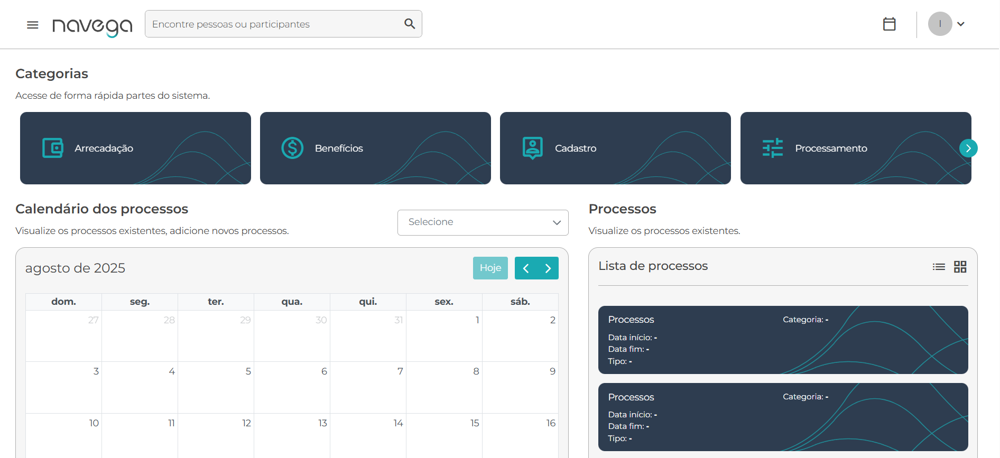
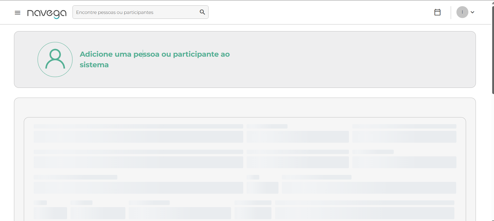

# Avaliação Técnica em Engenharia de Qualidade

## Objetivo
Este projeto tem como objetivo demonstrar minhas habilidades em Engenharia de Qualidade, incluindo:

- Testes de caixa preta e BDD
- Criação e documentação de casos de teste
- Identificação e registro de bugs
- Proposição de melhorias no sistema
- Automação de testes usando Cypress

O projeto simula cenários reais de teste em um sistema web, permitindo que sejam avaliadas minhas decisões técnicas e práticas profissionais.

---

## Estrutura do Repositório

qa-engineer-test-iasmin/
├── bugs/ # Templates e relatórios de bugs encontrados
│ └── ID_BUG-002.md
├── improvements/ # Propostas de melhoria do sistema
│ └── PM-002.md
├── test-cases/ # Casos de teste documentados
│ ├── Login.md
│ ├── Cadastro.md
│ └── evidence/ # Evidências dos testes (prints)
│ ├── login/
│ │ └── image-1.png
│ └── cadastro/
│ └── image-2.png
├── cypress/ # Automação de testes
│ ├── e2e/
│ │ └── login.cy.js
│ ├── fixtures/
│ └── screenshots/ # Screenshots geradas pelos testes
├── cypress.config.js # Configurações do Cypress
├── package.json # Dependências e scripts do projeto
└── README.md # Arquivo de instruções do projeto

---

## Funcionalidades Testadas

### 1. Login
- Cenário de login com sucesso  
  **Evidência:**  
  
- Cenário de login com dados inválidos
- Cenário de exceção (senha incorreta, campos em branco)  
- Captura de evidências via Cypress (`cypress/screenshots/login-sucesso.png`)

### 2. Cadastro de Participante
- Cenário de cadastro com sucesso  
  **Evidência:**  
  
- Cenário de campos obrigatórios não preenchidos
- Cenário de e-mail já existente
- Evidências de cada cenário incluídas na pasta `test-cases/evidence/cadastro/`

---

## Bugs Registrados

- **BUG-001**: Dados sensíveis expostos no payload da requisição de login 
  - Arquivo: `bugs/ID_BUG-001.md`
  - Severidade: Alta  
  - Prioridade: Alta  

  - **BUG-002**: Tela de adicionar pessoa/participante não esta carregando 
  - Arquivo: `bugs/ID_BUG-002.md`
  - Severidade: Critica  
  - Prioridade: Alta  

---

## Propostas de Melhoria

- **PM-001**: Implementar segurança na transmissão de credenciais de login  
  - Arquivo: `improvements/PM-001.md`
  - Justificativa: Melhorar usabilidade, confiabilidade e fluxo de cadastro do sistema

- **PM-002**: Implementar tratamento de erro na tela de cadastro de pessoa/participante  
  - Arquivo: `improvements/PM-002.md`
  - Justificativa: Garantir conformidade com boas práticas de segurança
---

## Automação de Testes

- Ferramenta utilizada: **Cypress com JavaScript**
- Cenários automatizados:
  - Login
  - Cadastro de participantes
- Boas práticas aplicadas:
  - Organização dos testes por funcionalidade
  - Uso de screenshots para evidências
  - Comandos claros e assertivas objetivas

---

## Como Executar o Projeto

1. Clonar o repositório:

```bash
git clone https://github.com/IasminVicente/qa-engineer-test-iasmin.git
cd qa-engineer-test-iasmin
