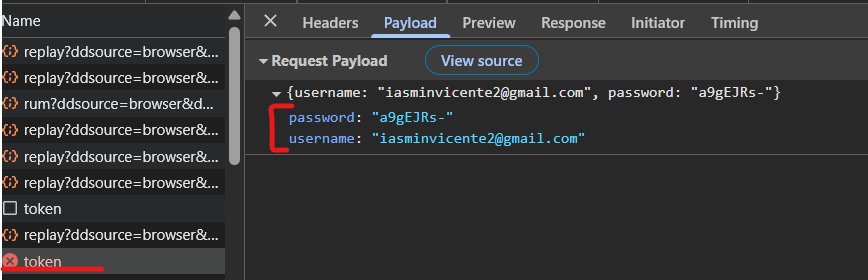

# Registro de BUG

Arquivo: `/Bug/template-bug-report.md`

**Bug:** Dados sensíveis expostos no payload da requisição de login

**Descrição:**

Ao realizar o login no sistema, as credenciais do usuário (e-mail e senha) estão sendo enviadas no payload da requisição em texto puro. 

**Cenário de Reprodução:**

1. Acessar a página de login (https://qa.navega.com.vc/login)
2. Informar e-mail válido e senha válida.
3. Clicar no botão "Acessar".
4. Abrir o DevTools do navegador (F12) e ir até a aba Network.
5. Localizar a requisição enviada pelo serviço /auth/token no momento do login
5. Verificar que o payload da requisição contém o usuário e a senha em texto puro

**Resultado Atual:**

O payload da requisição contém os dados de login do usuário. Expor o usuário e senha em payload é uma falha grave de segurança, podendo trazer problemas para a empresa.

**Resultado Esperado:**

O payload não deve expor informações críticas diretamente esses dados sensíveis devem ser tratados de forma segura (ex.: criptografia, hash, token seguro).

**Sugestão de Correção:**

Implementar criptografia adequada para o tráfego de credenciais, utilizando protocolos seguros (HTTPS obrigatório). Avaliar mecanismos de autenticação mais seguros, como OAuth2 ou JWT.

**Evidência:**

**Hipótese Técnica:** Exposição de credenciais no payload.

**Ambiente**: WEB

**Versão:** v3.1.1

**Sistema Operacional:** Windows

**Navegador:** Chrome
'