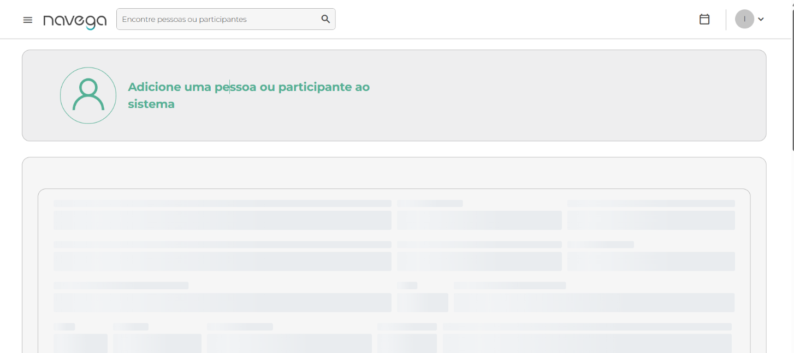

# Caso de Teste

Arquivo: `/CasosDeTeste/template-caso-de-teste.md`

| ID | Cenário | Pré-condições | Passos | Resultado Esperado | Resultado Obtido | Prioridade |
| --- | --- | --- | --- | --- | --- | --- |
| CT003 | Validar o fluxo de cadastro de participante | Usuário deve estar na página https://qa.navega.com.vc/registration | 1. Acessar a página de registro. 2. Clicar em adicionar nova pessoa ou participante 3. Preencher os campos obrigatório 4. Clicar no botão Cadastrar. 5. Aguardar resposta do sistema. | O sistema deve cadastrar o novo participante, exibindo mensagem de sucesso e redirecionar para a página inicial ou painel do usuário. | Tela Acion Adicione uma pessoa ou participante não é carregada | Alta |

Funcionalidade: Cadastro de novo participante  

Cenário 1: Validar cadastro realizado com sucesso
    Dado que o usuário está na página de cadastro
    E clica no botão Adicionar nova pessoa ou participante
    Quando preencher corretamente os campos obrigatórios 
    E clicar no botão "Cadastrar"
    Então o sistema deve registrar o usuário, exibindo mensagem de sucesso

Evidência: 

| ID | Cenário | Pré-condições | Passos | Resultado Esperado | Resultado Obtido | Prioridade |
| --- | --- | --- | --- | --- | --- | --- |
| CT004 | Validar mensagens de erro ao tentar cadastrar sem preencher campos obrigatórios | Estar na tela adiciona uma pessoa ou participante | 1. Fazer login no app. 2. Clicar no menu Cadastro 3. Clica no botão Adcionar nova pessoa ou participante 4. Deixar um ou mais campos obrigatórios em branco.
5. Clicar no botão Cadastrar. | O sistema deve exibir mensagens de validação informando quais campos obrigatórios não foram preenchidos e impedir o cadastro. | Tela Acion Adicione uma pessoa ou participante não é carregada | Alta |

Funcionalidade: Cadastro de novo participante  

Cenário 2: Validar campos obrigatórios não preenchidos
    Dado que o usuário está na página de registro
    Quando tentar submeter o formulário sem preencher todos os campos obrigatórios
    Então o sistema deve exibir mensagens de validação informando quais campos estão faltando

Evidência: 

| ID | Cenário | Pré-condições | Passos | Resultado Esperado | Resultado Obtido | Prioridade |
| --- | --- | --- | --- | --- | --- | --- |
| CT005 | Validar mensagem de erro ao cadastrar com e-mail já existente | Usuário logado no sistema e na tela de adionar uma pessoa ou participante no sistema. É necessário ter um e-mail já cadastrado previamente. | 1. Fazer login no app. 2. Clicar no menu Cadastro 3. Clica no botão Adcionar nova pessoa ou participante | 4. Inserir no campo E-mail um endereço que já esteja cadastrado no sistema 5. Clicar no botão Cadastrar. | O sistema deve exibir a mensagem "E-mail já cadastrado" e impedir a criação de um novo usuário.| Tela Acion Adicione uma pessoa ou participante não é carregada | Alta |

Funcionalidade: Cadastro de novo participante  

Cenário 2: Validar mensagem de erro ao cadastrar com e-mail já existente
    Dado que o usuário está logado no sistema
    E está na tela de registro
    E preenche o campo e-mail com um já cadastrado no sistema
    Quando tentar realizar o cadastro
    Então o sistema deve exibir a mensagem "E-mail já cadastrado"
    E impedir a criação do novo usuário

Evidência: 
