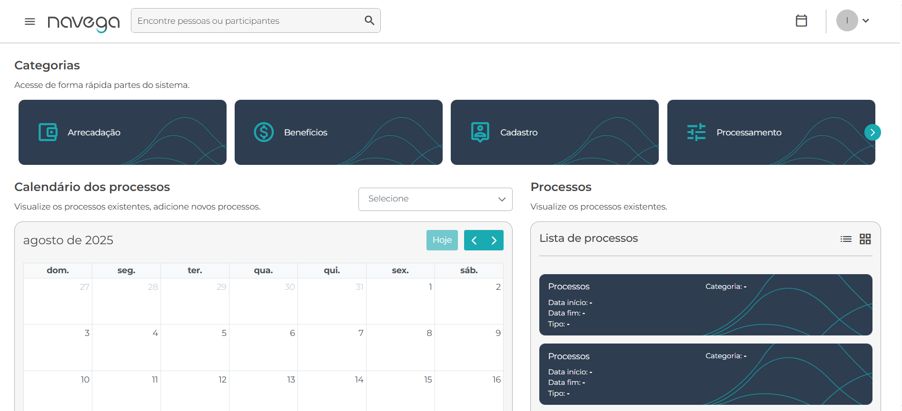

# Caso de Teste

Arquivo: `/CasosDeTeste/template-caso-de-teste.md`

| ID | Cenário | Pré-condições | Passos | Resultado Esperado | Resultado Obtido | Prioridade |
| --- | --- | --- | --- | --- | --- | --- |
| CT001 | Validar login com credenciais válidas | Usuário possui e-mail e senha válidos cadastrados | 1. Acessar a URL: https://qa.navega.com.vc/login 2. Informar e-mail válido 3. Informar senha válida 4. Clicar no botão Entrar | O sistema deve autenticar o usuário com sucesso e redirecionar para a página inicial do sistema | Aguardando execução | Alta |

Funcionalidade: Login de Usuário  
Cenário 1: Realizar login com credenciais válidas
    Dado que o usuário acesse a página "https://qa.navega.com.vc/login"  
    E informe e-mail e senha válidos  
    Quando clicar no botão "Entrar"  
    Então o sistema deve autenticar o usuário com sucesso  
    E redirecionar para a página inicial do sistema  

Evidência: 

---

| ID | Cenário | Pré-condições | Passos | Resultado Esperado | Resultado Obtido | Prioridade |
| --- | --- | --- | --- | --- | --- | --- |
| CT002 | Validar comportamento do sistema quando o login estiver indisponível | Serviço de login fora do ar | 1. Acessar a URL: https://qa.navega.com.vc/login 2. Informar e-mail válido 3. Informar senha válida 4. Clicar no botão Entrar | O sistema não deve autenticar o usuário e deve exibir uma mensagem clara de indisponibilidade | Sucesso | Crítica |

Funcionalidade: Login de Usuário  
Cenário 2: Tentar realizar login quando o serviço estiver indisponível  
    Dado que o usuário acesse a página "https://qa.navega.com.vc/login"  
    E informe um e-mail e senha válidos  
    Quando clicar no botão "Entrar"  
    Então o sistema não deve autenticar o usuário exibindo uma mensagem clara como "Serviço temporariamente indisponível, tente novamente mais tarde"  
  
Evidência: 
